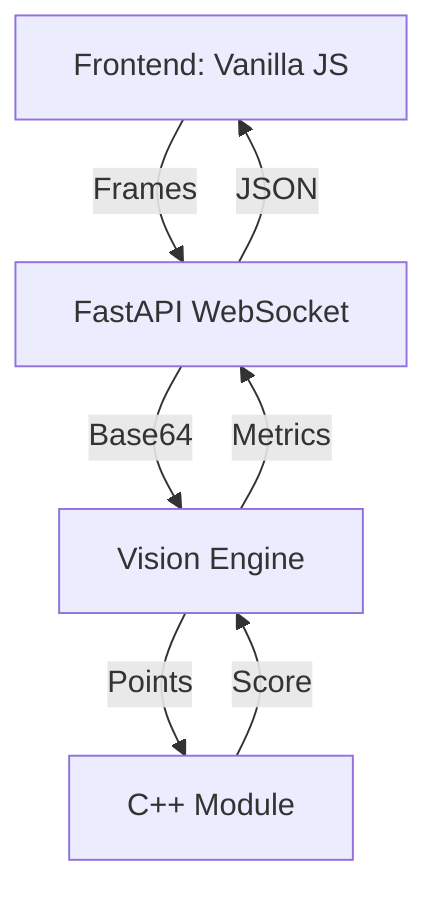

# 🎯 FocusFlow: Real-Time Meeting Engagement Analytics

> **Premium Engagement Tracking Powered by AI and C++**  
> Focused on Professional Productivity and Group Dynamic Monitoring.

---

## 📋 Project Overview

**FocusFlow** is a modern web application that analyzes video feeds (camera or screen share) to compute real-time **Engagement Scores**. It provides deep insights into focus levels, emotional state, and group dynamics during professional meetings.

### Key Features:
- **Computer Vision**: Face detection, head pose estimation, and iris tracking via MediaPipe.
- **C++ Performance**: High-speed metrics calculation via custom C++ PyBind11 extension.
- **Meeting Intel**: Multi-participant detection and group engagement analytics.
- **Modern UI**: Asymmetric, professional dashboard design with real-time WebSocket feedback.
- **Persistence**: SQLite-backed session history and trend analysis.

---

## 🏗️ Architecture



---

## 🛠️ Tech Stack

| Component | Technology |
|-----------|-----------|
| **Backend** | Python 3.10+, FastAPI |
| **Frontend** | HTML5, CSS3, Vanilla JavaScript |
| **Vision** | OpenCV, Google MediaPipe |
| **Performance** | C++17, PyBind11 |
| **Database** | SQLite3 |

---

## 📁 Clean Folder Structure

```
FocusFlow/
├── cpp_modules/       # ⚡ C++ Performance Module (Source)
├── frontend/          # 🎨 Modern Web Interface (HTML/CSS/JS)
├── src/               # 🧠 Core Application Logic
│   ├── main.py        # FastAPI Gateway & Websockets
│   ├── vision_engine.py# AI Vision Orchestrator
│   ├── database.py    # SQLite Persistence Layer
│   └── utils/         # 🛠️ Utility Scripts
├── data/              # 🗄️ Storage (Database files)
├── architecture.md    # 🏗️ Detailed Technical Docs
├── file_manifest.md   # 📄 Breakdown of every file
├── run.bat            # 🚀 One-Click Launcher (Windows)
├── build_cpp.bat      # 🛠️ C++ Compilation Tool
└── requirements.txt   # 📦 Dependencies
```

---
