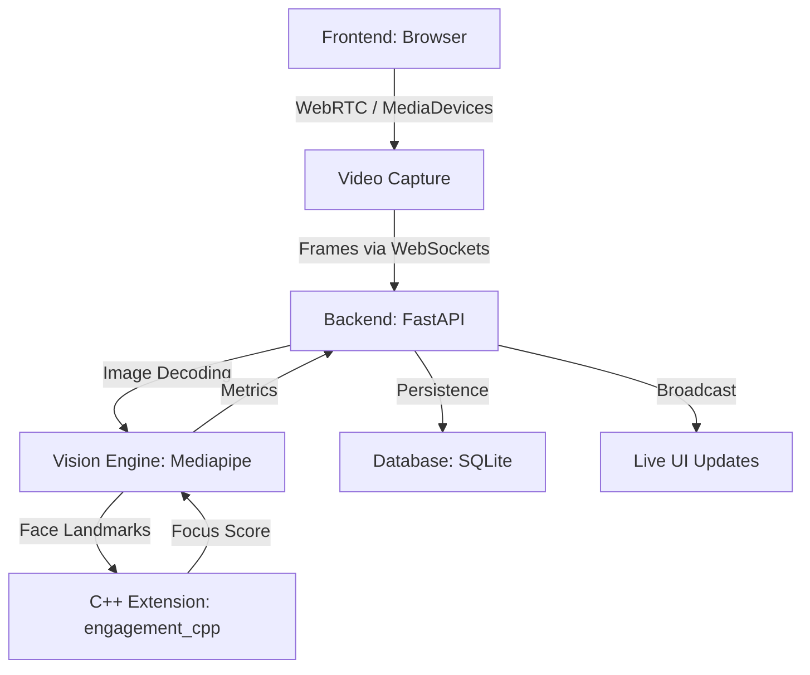

# FocusFlow System Architecture

FocusFlow is a real-time engagement analytics engine designed for professional individual and meeting environments. It combines high-performance C++ computation with modern web technologies and AI.

## 1. High-Level Diagram

## 2. Component Breakdown

### A. Frontend Layer (Vanilla JS)
We intentionally used Vanilla JS and CSS to ensure zero overhead and maximum performance.
- **WebSocket Gateway**: Handles the high-frequency transmission of video frames from the browser to the server.
- **MediaStream API**: Accesses the user's camera or screen share natively.
- **Dynamic UI**: Updates markers, engagement bars, and group metrics without page reloads.

### B. Backend Layer (Python/FastAPI)
FastAPI provides the asynchronous backbone required for handling live streams.
- **Session Manager**: Tracks whether the user is in an individual session or a group meeting.
- **Frame Processor**: Concurrently decodes incoming Base64 frames and routes them to the AI engine.

### C. Intelligence Layer (AI & C++)
This is the "Brain" of FocusFlow.
- **Vision Engine**: Uses Google Mediapipe for facial landmark detection and iris tracking.
- **C++ Precision Module**: A custom extension (`engagement_cpp`) written in C++ and exposed via PyBind11. It performs the heavy mathematical lifting for gaze estimation and stability calculation, ensuring the application remains responsive.

### D. Data Layer (SQLite)
- Stores session timestamps, average scores, and meeting participant counts.
- Enables the "History" feature for long-term productivity tracking.
